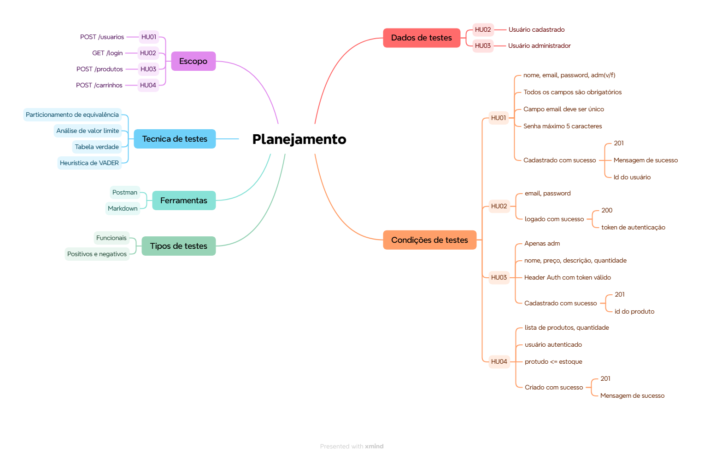

# **Teste de API REST e Documentação**

##  Visão Geral
Este repositório contém um projeto de testes de API REST utilizando a ServeRest como sistema em teste. O objetivo é demonstrar conhecimentos em estratégia, execução e documentação de testes de API.

## Mindmap do planejamento

##  API Testada

- **Nome da API:** ServeRest
- **Tipo:** API REST
- **URL:** https://serverest.dev/

## Escopo do Projeto

## Estrategia de Testes
A estratégia de testes utilizada nesse projeto pode ser encontrada em: **[Estratégia de Testes](./docs/estrategia-de-testes.md)**

## Histórias de Usuário Testadas
**Cada história de usuário está documentada em um único arquivo, contendo:**
- Entendimento da funcionalidade
- Regras de negócio
- Cenários de teste
- Casos de teste

**Histórias abordadas:**
- **[Cadastro de usuario](./docs/historias/HU01-cadastro-de-usuario.md)**
- **[Login de usuário](./docs/historias/HU02-login-de-usuario.md)**
- **[Cadastro de produto](./docs/historias/HU03-cadastro-de-produto.md)**
- **[Criação de carrinho](./docs/historias/HU04-criacao-de-carrinho.md)**

## Relatório de bugs
O relatório de bugs feito nesse projeto está presente em **[Relatório de bugs](./docs/relatorio-de-bugs.md)**

## Ferramentas utilizadas
* **Postman**: Execução de testes.
* **Swagger**: Teste de contrato.
* **Markdown**: Escrita e estruturação da documentação técnica.

## Como Executar os Testes
1. Importar a collection do Postman
2. Executar as requisições
3. Verificar scripts de validações
4. Consultar evidências na pasta da história

